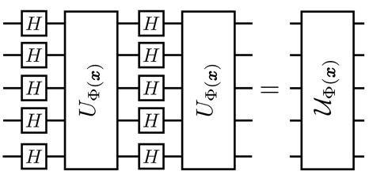
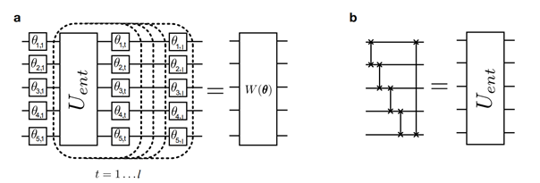
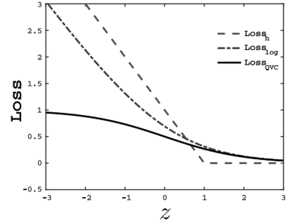

# Quantum Variational Classifier

This week, I continue my literature review on possible candidate network structure for my quantum neural network that is capable of running on near term devices. There's a particular paper that introduced a structure that's similar to support vector machines and I'll make a brief introduction of this concept.

In the paper *Supervised learning with quantum-enhanced feature spaces*, the authors developed a SVM-like network structure which they called quantum variational classifier. The network consists of 4 parts: qubit initialization, data-mapping with quantum features, weight gates and measurements, as shown in the figure below.

## Quantum data encoding

To obtain quantum advantage on feature conversion, instead of mapping each input to a separate qubit, we want to instead kernel $K(x, y)=|\langle\Phi(x) \mid \Phi(y)\rangle|^{2}$ that’s hard to be estimated classically. A family of such quantum encoding is shown below. By alternating Hadamard gates $H$ and nonlinear feature map $U_\Phi(x)$, we can create a superposition encoding that's impossible for classical computers to estimate efficiently.

Note that the high dimension in Hilbert space provided by quantum computers *does not* provide exponential speedup by default because in the classical neural networks, high dimension matrix products are handles by [Kernel method](https://en.wikipedia.org/wiki/Kernel_method) which is already efficient.

## Quantum variational classification model

The quantum gates that represent weights have the following representation
$$
W(\boldsymbol{\theta})=U_{\mathrm{loc}}^{(l)}\left(\theta_{l}\right) U_{\mathrm{ent}} \ldots U_{\mathrm{loc}}^{(2)}\left(\theta_{2}\right) U_{\mathrm{ent}} U_{\mathrm{loc}}^{(1)}\left(\theta_{1}\right),
$$
where $U_{\mathrm{ent}}=\prod_{(i, j) \in E} \mathrm{CZ}(i, j)$ is a controlled $Z$ gate which creates entanglements between qubits. In general, $U_{ent}$ cant be a controlled rotation gate that's suitable for specific quantum device structures.

By alternating entanglement gates $U_{\mathrm{ent}}$ and rotation gates $U_{\mathrm{loc}}\left(\theta_{l}\right)$, the circuit is able to create large scale of entanglement that's very difficult to do on a classical computer and demonstrate quantum advantage.

## Cost function

The cost function of the network is calculated in the following steps:

Assume we classify labels $y \in\{-1,1\}$ by taking $R$ shots
$$
\hat{p}_{y}=\frac{r_{y}}{R}
$$
The label is misclassified if
$$
p_{y}<\hat{p}_{-y}+y b \rightarrow r_{y}<r_{-y}+y b R \rightarrow r_{y}<\left\lceil\frac{1-y b}{2} R\right]
$$
we can approximate the probability of misclassifying a sample with the binomial CDF  and use it as an error function:
$$
\begin{aligned}
\operatorname{Pr}\left(\tilde{m}_{\mid T}(s) \neq y \mid s \in T_{y}\right) &=\sum_{j=0}^{\left\lceil\left(\frac{1-y b}{2}\right) R\right\rceil}\left(\begin{array}{c}
R \\
j
\end{array}\right) p_{c}^{R-j}\left(1-p_{c}\right)^{j} \approx \int_{-\infty}^{\gamma} d x \frac{1}{\sqrt{2 \pi} \beta} \exp \left(-\frac{1}{2}\left(\frac{x-a}{\beta}\right)^{2}\right) \\
&=\frac{1}{\sqrt{\pi}} \int_{-\infty}^{\frac{\gamma-a}{\sqrt{2} \beta}} d z e^{-z^{2}}=\frac{1}{2} \operatorname{erf}\left(\frac{\gamma-a}{\sqrt{2} \beta}\right)+\frac{1}{2} \\
&=\frac{1}{2} \operatorname{erf}\left(\sqrt{R} \frac{\frac{1-y b}{2}-p_{y}}{\sqrt{2\left(1-p_{y}\right) p_{y}}}\right)+\frac{1}{2}
\end{aligned}
$$
To further simplify the cost function, we use a sigmoid function
$$
\operatorname{Pr}\left(\tilde{m}_{\mid T}(s) \neq y \mid s \in T_{y}\right) \approx \operatorname{sig}\left(\sqrt{R} \frac{\frac{1-y b}{2}-p_{y}}{\sqrt{2\left(1-p_{y}\right) p_{y}}}\right)
$$
which can be calculated efficiently.

## Comparing to SVM

The resulting network can be formatted as the following problem:
$$
\text{maximize }\gamma \\
\text{subject to } \|\mathbf{w}\|_{2}^{2}=1,\\
y_{i}\left(\mathbf{w} \circ \Phi\left(\boldsymbol{x}_{i}\right)+b\right) \geq \gamma \quad \forall i=1, \ldots, t
$$
which is similar to the support vector machine problem ($
\operatorname{minimize} L_{P}=\frac{1}{2}\|\mathbf{w}\|^{2}
\text { subject to } y_{i}\left(\mathbf{w} \circ \boldsymbol{x}_{i}+b\right) \geq 1 . \quad \forall i=1, \ldots, t
$).

The model also differs from SVM in several ways, mainly due to the shape of the gradient of the loss function:

The loss function for QVC doesn't increase linearly with the error margin, which means it's most sensitive to the error around the classifying hyperplane.

Overall, the most noteworthy feature of the quantum variational classifier is its ability to efficiently map classical data to quantum and demonstrate quantum advantage at the same time. I think it's suitable to run on near-term quantum hardware and is therefore potential candidate suitable for the current project.

---

*[Submit feedback](https://github.com/leumasli/EE113D-Blog/issues/new)* or  
*[Return to overview](index.md)*

