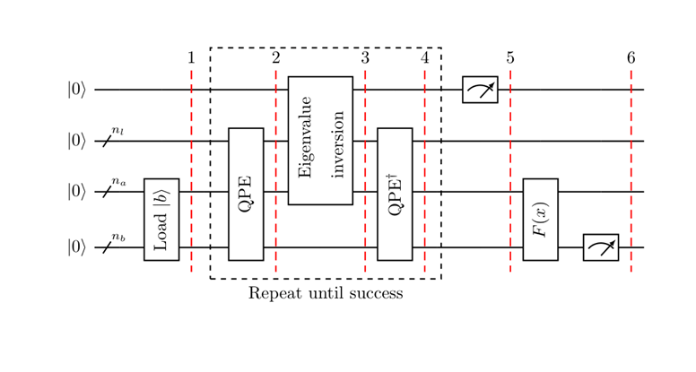

# Week 4: Solving Linear Equations with HHL algorithm

This week, I started studying quantum subroutines in machine learning. One common task is to solve linear equations. Harrow et al. introduced an algorithm in the paper [Quantum Algorithm for Linear Systems of Equations](https://journals.aps.org/prl/abstract/10.1103/PhysRevLett.103.150502) in 2009 an algorithms (HHL algorithm) solving $\vec{x}$ in the system $A\vec x = \vec b$ given $A$ and $\vec b$ which provided exponential speedup over classical algorithms under ideal conditions.

- Given a matrix $A$ and a vector $\vec{b}$, find a vector $\vec{x}$ such that $A \vec{x}=\vec{b}$
- If the matrix is $s$-sparse, the best classical algorithm has complexity $\mathcal{O}(N s \kappa \log (1 / \epsilon))$ where $\kappa$ denotes the condition number of the system and $\epsilon$ the accuracy of the approximation.
- This paper introduced the HHL algorithm which is a quantum algorithm has complexity $\mathcal{O}\left(\log (N) s^{2} \kappa^{2} / \epsilon\right)$ which provides up to exponential speedup over classical algorithms

## Problem Setup

- Encode the equation in the quantum language, we get
$$
A|x\rangle=|b\rangle
$$
- Because $A=A^{\dagger}$, we can write $A$ in terms of its spectral decomposition
$$
A=\sum_{j=0}^{N-1} \lambda_{j}\left|u_{j}\right\rangle\left\langle u_{j}\right|, \quad \lambda_{j} \in \mathbb{R}
$$
- Apply $\lambda^{-1} A$ on both sides of the eigenvalue equation, we get
$$
A^{-1}=\sum_{j=0}^{N-1} \lambda_{j}^{-1}\left|u_{j}\right\rangle\left\langle u_{j}\right|
$$
- We can also express $|b\rangle$ in the eigenbasis of $A$

$$
|b\rangle=\sum_{j=0}^{N-1} b_{j}\left|u_{j}\right\rangle
$$

## HHL Algorithm

- Load $|0\rangle_{n_{b}} \mapsto|b\rangle_{n_{b}}$
- Apply QPE with
$$
U=e^{i A t}:=\sum_{j=0}^{N-1} e^{i \lambda_{j} t}\left|u_{j}\right\rangle\left\langle u_{j}\right|
$$
The quantum state after $\mathrm{QPE}$ is
$$
\sum_{j=0}^{N-1} b_{j}\left|\lambda_{j}\right\rangle_{n_{l}}\left|u_{j}\right\rangle_{n_{b}}
$$
- We now add an auxiliary qubit and apply a conditional rotation with control qubit as $n l$

$$
\sum_{j=0}^{N-1} b_{j}\left|\lambda_{j}\right\rangle_{n_{l}}\left|u_{j}\right\rangle_{n_{b}}\left(\sqrt{1-\frac{C^{2}}{\lambda_{j}^{2}}}|0\rangle+\frac{C}{\lambda_{j}}|1\rangle\right)
$$

- Apply inverse QPE which resets $\left|\lambda_{j}\right\rangle_{n l}$ to $|0\rangle$
- Measure the auxiliary qubit. If the outcome is $|1\rangle$, the register is in the state
$$
\left(\sqrt{\frac{1}{\sum_{j=0}^{N-1}\left|b_{j}\right|^{2} /\left|\lambda_{j}\right|^{2}}}\right) \sum_{j=0}^{N-1} \frac{b_{j}}{\lambda_{j}}|0\rangle_{n_{l}}\left|u_{j}\right\rangle_{n_{b}}
$$
​	Which corresponds to the solution up to a normalization factor.

## Notes

- If $A$ is not Hermitian, construct
$$
C=\left(\begin{array}{cc}
0 & A \\
A^{\dagger} & 0
\end{array}\right)
$$
​	and solve the equation $C \vec{y}=\left(\begin{array}{l}\vec{b} \\ 0\end{array}\right)$ to obtain $y=\left(\begin{array}{l}0 \\ \vec{x}\end{array}\right)$
- Note that HHL with $\mathcal{O}\left(\log (N) s^{2} \kappa^{2} / \epsilon\right)$ is more sensitive to sparsity, condition of the matrix and error than traditional algorithms with $\mathcal{O}(N s \kappa \log (1 / \epsilon))$

- The complexity of HHL is roughly $\mathcal{O}(\log(N))$ which is actually less than printing out all the terms of the result state $|x\rangle$ which is $\mathcal O(N)$! In realistic situations, we usually don't care about the specific values of $x$ but rather some other expressions such as the expectation value of some operator $\langle x | M | x\rangle$. HHL can be a useful subroutine for such tasks.

---

*[Submit feedback](https://github.com/leumasli/EE113D-Blog/issues/new)* or  
*[Return to overview](index.md)*