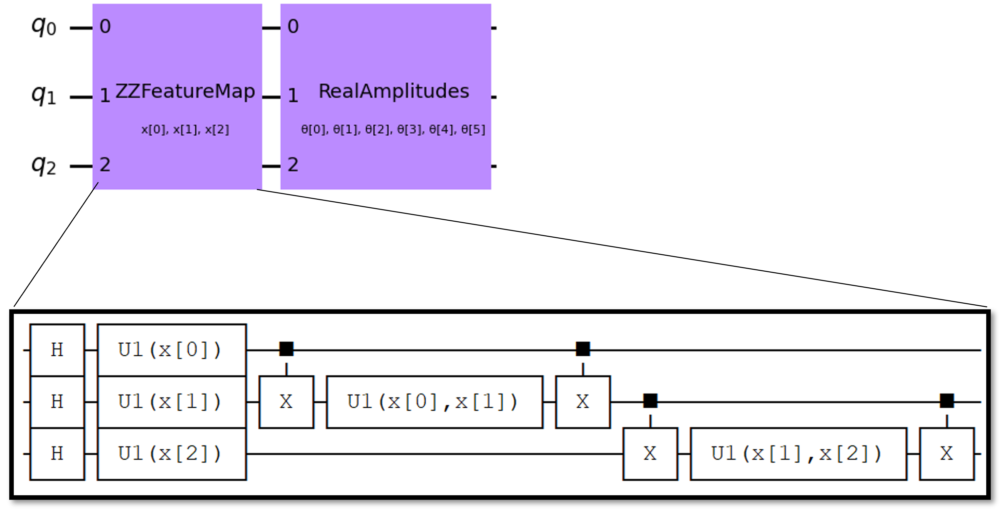
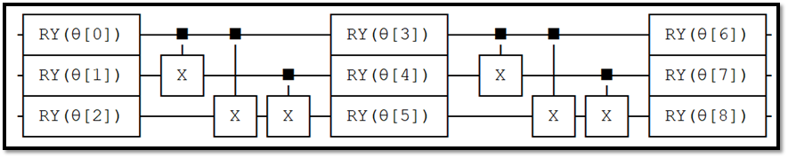

## Week 5: Proof of Concept Forward Pass

This week, I started implementing quantum neural network models in Qiskit. The network consists an encoding network and matrix multiplication network. The first network entangles classical data into quantum form and the second network  calculates the product of input and weights. This will ideally be part of the complete neural network and I believe it was worth trying implementing.

I implemented a forward pass of the following network as the following

The ZZFeatureMap network takes the data and encode quantum features in the dataset, and RealAmplitudes performs neural calculation, as the following figure illustrates.

This network only consists 3 qubits and is therefore largely a proof of concept. Because of the low qubit count, There's not good dataset available for testing. I'm still working on implementing backward pass for training and expand the network.