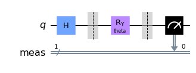

# Week 6 Updates

The goal for this week was to take a closer look into implementing the backward pass of the quantum neural network. The actual training of the neural network happens during the back pass, through optimization methods such as gradient descent. Therefore it's important to ways to train the quantum neural network.

This week, I looked into several ways to implement the backward pass. The goal is to adjust the weights which are represented rotation angles of the controlled rotation gates. A simple example is shown in the figure below. The input is put in superposition by the Hadamard gate and undergo controlled rotation. The rotation angle $\theta$ is the parameter to be learned.

People have proposed novel ways such as [using Grover search to optimize the parameters of the networks](https://proceedings.neurips.cc/paper/2003/hash/505259756244493872b7709a8a01b536-Abstract.html)[1]. However, because of the familiarity and Qiskit's integration with classical neural network framework PyTorch, I decided to look into applying gradient descent in quantum machine learning. [A promising approach is proposed by Crooks using parameter-shift rule](http://arxiv.org/abs/1905.13311)[2]. In short, the derivative of the circuit in the form of $f(\theta)=\left\langle\psi\left|U_{G}^{\dagger}(\theta) A U_{G}(\theta)\right| \psi\right\rangle$ with distinct eigenvalues $e_0, e_1$ with respect to rotational angle can be expressed as 
$$
\frac{d}{d \theta} f(\theta)=r\left[f\left(\theta+\frac{\pi}{4 r}\right)-f\left(\theta-\frac{\pi}{4 r}\right)\right]
$$
where the shift constant is $r=\frac{a}{2}\left(e_{1}-e_{0}\right)$. The parameter-shift method requires the performance of two circuits with same number of gates as the original circuit doesn't require additional qubits. 

My plan for next week is to understand the parameter-shift method in full and especially look into its applicability into larger-scale quantum networks, as well as implement the backward pass of the quantum network.

## Reference

[1] B. Ricks and D. Ventura, “Training a Quantum Neural Network,” in *Advances in Neural Information Processing Systems*, 2004, vol. 16. Accessed: Dec. 30, 2021. [Online]. Available: https://proceedings.neurips.cc/paper/2003/hash/505259756244493872b7709a8a01b536-Abstract.html

[2] G. E. Crooks, “Gradients of parameterized quantum gates using the parameter-shift rule and gate decomposition,” *arXiv:1905.13311 [quant-ph]*, May 2019, Accessed: Feb. 08, 2022. [Online]. Available: http://arxiv.org/abs/1905.13311
